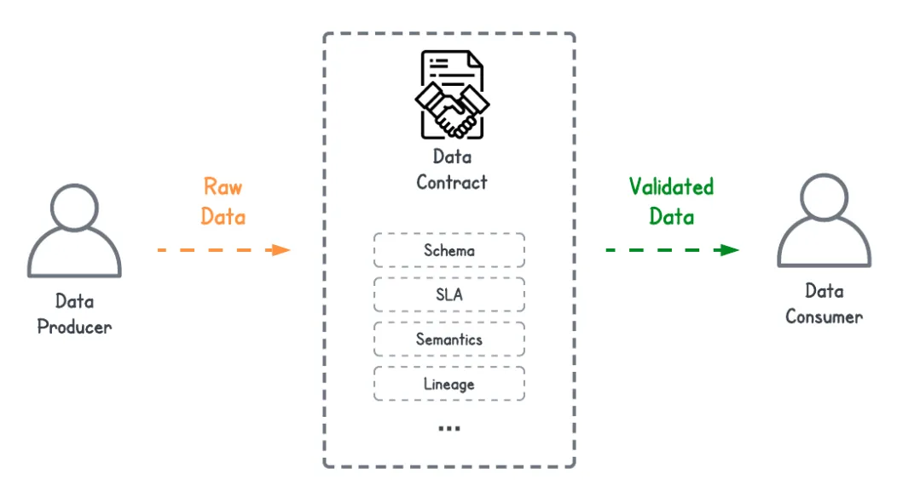

Data contracts
==============

# Table of Contents
* [Overview](#overview)
* [Specifications](#specifications)
* [Definitions](#definitions)
  * [Definition by Atlan](#definition-by-atlan)
  * [Definition by David Jayatillake](#definition-by-david-jayatillake)
  * [Definition by Andrew James](#definition-by-andrew-james)
* [References](#references)
  * [Use cases](#use-cases)
  * [Web sites, blogs](#web-sites-blogs)
    * [Data contracts for the warehouse on Substack](#data-contracts-for-the-warehouse-on-substack)
    * [Data products, Chad Sanderson on Substack](#data-products-chad-sanderson-on-substack)
    * [Data contracts demystified, by Atlan](#data-contracts-demystified-by-atlan)
  * [Collection of articles](#collection-of-articles)
    * [Awesome data contracts](#awesome-data-contracts)
  * [Articles](#articles)
    * [DBT Model Contracts: Importance and Pitfalls](#dbt-model-contracts-importance-and-pitfalls)
    * [DBT implementing data contracts](#dbt-implementing-data-contracts)
    * [Data contracts, the missing foundation](#data-contracts-the-missing-foundation)
    * [An engineering guide to data creation and data quality, a data contract perspective](#an-engineering-guide-to-data-creation-and-data-quality-a-data-contract-perspective)
    * [Data contracts for the warehouse](#data-contracts-for-the-warehouse)
    * [Data contracts wrapped 2022](#data-contracts-wrapped-2022)
    * [Data contracts in practice](#data-contracts-in-practice)
    * [An Engineer's guide to Data Contracts](#an-engineers-guide-to-data-contracts)
    * [The production\-grade Data Pipeline](#the-production-grade-data-pipeline)
    * [Yet another post on Data Contracts](#yet-another-post-on-data-contracts)
    * [Fine, let us talk about data contracts](#fine-let-us-talk-about-data-contracts)
    * [Data contracts \- From zero to hero](#data-contracts---from-zero-to-hero)
    * [Contracts have consequences](#contracts-have-consequences)
    * [Data Person: Attorney At Law](#data-person-attorney-at-law)
    * [The rise of data contracts](#the-rise-of-data-contracts)
    * [Interfaces and breaking stuff](#interfaces-and-breaking-stuff)
    * [Implementing Data Contracts: 7 Key Learnings](#implementing-data-contracts-7-key-learnings)
    * [Shifting left on governance: DataHub and schema annotations](#shifting-left-on-governance-datahub-and-schema-annotations)
    * [Data contracts at GoCardless, 6 months on](#data-contracts-at-gocardless-6-months-on)
    * [Improving data quality with data contracts](#improving-data-quality-with-data-contracts)
  * [Podcast episodes](#podcast-episodes)
    * [Data Quality and Data Contracts with Chad Sanderson of Data Quality Camp](#data-quality-and-data-contracts-with-chad-sanderson-of-data-quality-camp)
    * [Making Sense Of The Technical And Organizational Considerations Of Data Contracts](#making-sense-of-the-technical-and-organizational-considerations-of-data-contracts)
    * [Build A Common Understanding Of Your Data Reliability Rules With Soda Core and Soda Checks Language](#build-a-common-understanding-of-your-data-reliability-rules-with-soda-core-and-soda-checks-language)
* [Tools and frameworks](#tools-and-frameworks)
  * [Schemata](#schemata)
  * [OpenDataMesh](#opendatamesh)
  * [Avro / Schema Registry](#avro--schema-registry)
    * [Support by cloud vendors](#support-by-cloud-vendors)
  * [Protocol buffers (Protobuf)](#protocol-buffers-protobuf)
  * [Buz](#buz)
  * [Benthos](#benthos)
  * [Memphis](#memphis)
  * [API specifications](#api-specifications)
* [Exploration / Proof\-of\-Concept (PoC)](#exploration--proof-of-concept-poc)

Created by [gh-md-toc](https://github.com/ekalinin/github-markdown-toc.go)

# Overview
[This project](https://github.com/data-engineering-helpers/data-contracts)
intends to document requirements and referential material to implement
data contracts in the perspective of data engineering on a
modern data stack (MDS).

Data contracts are essential to decouple data producers from data consumers,
while having both parties taking responsibility for their respective parts.

Even though the members of the GitHub organization may be employed by
some companies, they speak on their personal behalf and do not represent
these companies.

# Specifications
* Data contract as code (DCaC) principle: the data contracts must be specified
  thanks to an
  [Interface Definition Language (IDL)](https://en.wikipedia.org/wiki/Interface_description_language),
  for instance [Smithy](https://smithy.io/), [Protobuf](https://protobuf.dev/),
  [OpenDataMesh](https://dpds.opendatamesh.org/),
  [Avro](https://avro.apache.org/docs/) or [dbt schema](https://getdbt.com)
  
* Shift-left principle: as much as meta-data as possible should be
  written directly within the IDL-based data contracts, potentially
  through annotations and/or naming conventions as comments
  
* The idea behind the two above-mentioned principles is to have the IDL-based
  specifications materializing the
  [single version of the truth (SVOT)](https://en.wikipedia.org/wiki/Single_version_of_the_truth)
  for the data sets, while benefitting from the whole automation and tooling
  that an open standard such as OpenDataMesh, Smithy and Protobuf bring

* The data contracts should support at least the following features:
  + Data validation / Data quality - From the data contracts, we should be
    able to generate specifications for specific tools such as
	[Great Expectations](https://greatexpectations.io/),
	[Deequ](https://github.com/awslabs/deequ),
	[dbt data testing](https://www.getdbt.com/product/data-testing/)
	or [SODA data quality platform](https://www.soda.io/data-quality-platform)
  + Generation of data schemas for a few specific compute enginees such as
    [Spark data types](https://spark.apache.org/docs/latest/sql-ref-datatypes.html),
    [Flink data types](https://nightlies.apache.org/flink/flink-docs-master/docs/dev/table/types/),
    [Python Dataclasses](https://docs.python.org/3/library/dataclasses.html),
	[Pandera](https://pandera.readthedocs.io/en/stable/),
	[Pydantic](https://docs.pydantic.dev/)
	or [Pandas](https://towardsdatascience.com/data-quality-check-for-your-data-analysis-tutorial-with-pandas-7ee96d7dc4b6)

# Definitions

## Definition by Atlan
* Source: https://atlan.com/data-contracts/

A data contract outlines how data can get exchanged between two parties.
It defines the structure, format, and rules of exchange in a distributed
data architecture. These formal agreements make sure that there are not
any uncertainties or undocumented assumptions about data.

## Definition by Charles Verleyen
* Source: https://medium.astrafy.io/data-quality-with-great-expectations-e41504d93e17

Without high-quality data, every analytics initiative will be underwhelming at best
and actively damaging the business at worst. Data contracts are API-based agreements
between producers and consumers designed to solve exactly that problem Data Contracts
are not a new concept. They are simply new implementations of a very old idea
— that producers and consumers should work together to generate high-quality,
semantically valid data from the ground up.

## Definition by David Jayatillake
* Source: https://davidsj.substack.com/p/yet-another-post-on-data-contracts

In short, **a Data Contract is an enforceable agreement on structure
and format between the producer and consumer of data**.
You could even define it in a simpler way:
**a Data Contract is a guarantee on structure and format by a producer of data**.

## Definition by Andrew James
* Source: https://andrew-jones.com/blog/data-contracts/

Almost all data platforms start with a
[change data capture (CDC) service](https://en.wikipedia.org/wiki/Change_data_capture)
to extract data from an organisations transactional databases - the source of truth
for their most valuable data. That data is then transformed, joined,
and aggregated to drive analysis, modelling, and other downstream services.

However, this data has not been designed for these use cases - it has been designed
to satisfy the needs and requirements of the source applications and their day-to-day use.
It can then take significant effort to transform, deduce, and derive the data
in order to make it useful for downstream use cases.

Furthermore, breaking changes and data migrations will be a regular part of
the applications evolution and will be done without knowledge of how it has been
used downstream, leading to breaking changes affecting key reports and data-driven products.

For downstream users to confidently build on this valuable data, they need to know
the data they are using is accurate, complete, and future proof.
This is the _data contract_.

# References
* [Architecture principles for data engineering pipelines on the Modern Data Stack (MDS)](https://github.com/data-engineering-helpers/architecture-principles)
  + [Material for the Data platform - Architecture principles](https://github.com/data-engineering-helpers/architecture-principles/blob/main/material/README.md)
* Specifications/principles for a
  [data engineering pipeline deployment tool](https://github.com/data-engineering-helpers/data-pipeline-deployment)
  + [`dpcctl`, the Data Processing Pipeline (DPP) CLI utility](https://github.com/data-engineering-helpers/dppctl), a Minimal Viable Product (MVP) in Go
* [Material for the Data platform - Data quality](https://github.com/data-engineering-helpers/data-quality/blob/main/README.md)
* Quickstart guides:
  + [Schemata quickstart guide](schemata/quickstart/)
  + [Smithy quickstart guide](smithy/quickstart/)

## Use cases
* [Geonames Quality Assurance (QA) framework](https://github.com/data-engineering-helpers/data-quality/blob/main/README.md#geonames)
* [OpenTravelData (OPTD) Quality Assurance framework](https://github.com/data-engineering-helpers/data-quality/blob/main/README.md#opentraveldata-optd)

## Web sites, blogs

### Data contracts for the warehouse on Substack
* Link to the web site/blog: https://dataproducts.substack.com/p/data-contracts-for-the-warehouse

### Data products, Chad Sanderson on Substack
* Link to Chad Sanderson's profile: https://substack.com/profile/12566999-chad-sanderson
* Link to the newsletter subscription form: https://dataproducts.substack.com/

### Data contracts demystified, by Atlan
* Title: Data Contracts: The Key to Scaling Distributed Data Architecture and Reducing Data Chaos
* Date: April 2023
* Link to the web site: https://atlan.com/data-contracts/

## Collection of articles

### Awesome data contracts
* Link to the reference documentation on GitHub: https://github.com/AltimateAI/awesome-data-contracts

## Articles

### DBT Model Contracts: Importance and Pitfalls
* Title: DBT Model Contracts: Importance and Pitfalls
* Date: May 2023
* Author: Ramon Marrero
  ([Ramon Marrero on LinkedIn]([https://www.linkedin.com/in/tristanhandy/](https://www.linkedin.com/in/ramon-marrero-almonte/)),
  [Ramon Marrero on Medium]([https://www.getdbt.com/author/tristan-handy/](https://medium.com/@ramon-marrero)))
* Link to the article:
  https://medium.com/geekculture/dbt-model-contracts-importance-and-pitfalls-20b113358ad7
* Publisher: Medium

### DBT implementing data contracts
* Title: The next big step forwards for analytics engineering
* Date: April 2023
* Author: Tristan Handy
  ([Tristan Handy on LinkedIn](https://www.linkedin.com/in/tristanhandy/),
  [Tristan Handy on DBT's web site](https://www.getdbt.com/author/tristan-handy/))
* Link to the article:
  https://www.getdbt.com/blog/analytics-engineering-next-step-forwards/
* Publisher: DBT

#### Excerpts
dbt Core v1.5 is slated for release at the end of April, and it will include three new constructs:
* [Access](https://docs.getdbt.com/docs/collaborate/govern/model-access):
  Choose which models ought to be “private” (implementation details, handling complexity within one team or domain) and “public” (an intentional interface, shared with other teams). Other groups and projects can only ref a model — that is, take a critical dependency on it — in accordance with its access.
* [Contracts](https://docs.getdbt.com/docs/collaborate/govern/model-contracts):
  Define the structure of a model explicitly. If your model’s SQL doesn’t match the specified column names and data types, it will fail to build. Breaking changes (removing, renaming, retyping a column) will be caught during CI. On data platforms that support build-time constraints, ensure that columns are not null or pass custom checks while a model is being built, in addition to more flexible testing after.
* [Versions](https://docs.getdbt.com/docs/collaborate/govern/model-versions):
  A single model can have multiple versioned definitions, with the same name for downstream reference. When a mature model with an enforced contract and public access needs to undergo a breaking change, rather than breaking downstream queriers immediately, facilitate their migration by bumping the version and communicating a deprecation window.

In the future, individual teams will own their own data. Data engineering will own “core tables” or “conformed dimensions” that will be used by other teams. Ecommerce will own models related to site visits and conversion rate. Ops will own data related to fulfillment. Etc. Each of these teams will reference the public interfaces exposed by other teams as a part of their work, and periodically release upgrades as versions are incremented on upstream dependencies. Teams will review PRs for their own models, and so have more context for what “good” looks like. Monitoring and alerting will happen in alignment with teams and codebases, so there will be real accountability to delivering a high quality, high reliability data product. Teams will manage their own warehouse spend and optimize accordingly. And teams will be able to publish their own metrics all the way into their analytics tool of choice.

### PayPal open sources its data contract templates
* Title: PayPal open sources its data contract templates
* Date: May 2023
* Author: Jean-Georges Perrin
* Link to the article: https://jgp.ai/2023/05/01/paypal-open-sources-its-data-contract-template/
* Publisher: Jean-Georges Perrin's blog

### Data contracts, the missing foundation
* Title: Data contracts: The missing foundation
* Date: March 2023
* Author: Tom Baeyens ([Tom Baeyens on LinkedIn](https://www.linkedin.com/in/tombaeyens/), [Tom Baeyens on Medium](https://medium.com/@tombaeyens))
* Link to the article: https://medium.com/@tombaeyens/data-contracts-the-missing-foundation-3c7a98544d2a
* Publisher: Medium

### An engineering guide to data creation and data quality, a data contract perspective
* Title: An Engineering Guide to Data Creation and Data Quality - A Data Contract perspective
* Dates: March and May 2023
* Author: Ananth Packkildurai
  ([Ananth Packkildurai on LinkedIn](https://www.linkedin.com/in/ananthdurai/),
   [Ananth Packkildurai on Substack](https://substack.com/profile/3520227-ananth-packkildurai),
   [Ananth Packkildurai on GitHub](https://github.com/ananthdurai))
* Part 1:
  https://www.dataengineeringweekly.com/p/an-engineering-guide-to-data-creation
* Part 2:
  https://www.dataengineeringweekly.com/p/an-engineering-guide-to-data-quality
* Publisher:
  [Data Engineering Weekly (DEW) newsletter on Substack](https://www.dataengineeringweekly.com/)
* Note that Ananth Packkildurai is the main contributor of
  [Schemata](#schemata)

### Data contracts for the warehouse
* Title: Data contracts for the warehouse
* Date: January 2023
* Authors:
  + Chad Sanderson
    ([Chad Sanderson on LinkedIn](https://www.linkedin.com/in/chad-sanderson/),
    [Chad Sanderson on Substack](https://substack.com/profile/12566999-chad-sanderson))
  + Daniel Dicker
    ([Daniel Dicker on LinkedIn](https://www.linkedin.com/in/danieldicker/),
    [Daniel Dicker on Substack](https://substack.com/profile/48987754-daniel-dicker))
* Link to the web site/blog:
   https://dataproducts.substack.com/p/data-contracts-for-the-warehouse
* Publisher: Substack

### Data contracts wrapped 2022
* Title: Data contracts wrapped - 2022
* Date: December 2022
* Author: Shirshanka Das
  ([Shirshanka Das on LinkedIn](https://www.linkedin.com/in/shirshankadas/))
* Link to the article:
  https://medium.com/datahub-project/data-contracts-wrapped-2022-470e0c43365d
* Publisher: Medium

### Data contracts in practice
* Title: Data contracts in practice
* Date: December 2022
* Author: Andrea Gioia
  ([Andrea Gioia on LinkedIn](https://www.linkedin.com/in/andreagioia/),
  [Andrea Gioia on Medium](https://medium.com/@andrea_gioia),
  [Andrea Gioia on GitHub](https://github.com/andrea-gioia))
* Link to the article:
  https://betterprogramming.pub/data-contracts-in-practice-93e58d324f34
* Publihser: Medium
* Note that Andrea Gioia is the main contributor of
  [OpenDataMesh](#opendatamesh)

### An Engineer's guide to Data Contracts
* Title: An Engineer's guide to Data Contracts
* Date: October 2022
* Authors:
  + Chad Sanderson
    ([Chad Sanderson on LinkedIn](https://www.linkedin.com/in/chad-sanderson/),
    [Chad Sanderson on Substack](https://substack.com/profile/12566999-chad-sanderson))
  + Adrian Kreuziger
* Part 1:
  https://dataproducts.substack.com/p/an-engineers-guide-to-data-contracts
* Part 2:
  https://dataproducts.substack.com/p/an-engineers-guide-to-data-contracts-6df
* Publisher: Substack

### The production-grade Data Pipeline
* Title: The production-grade Data Pipeline
* Date: September 2022
* Author: Chad Sanderson
  ([Chad Sanderson on LinkedIn](https://www.linkedin.com/in/chad-sanderson/),
   [Chad Sanderson on Substack](https://substack.com/profile/12566999-chad-sanderson))
* Link to the article:
  https://dataproducts.substack.com/p/the-production-grade-data-pipeline
* Publisher: Substack

### Yet another post on Data Contracts
* Title: Yet another post on Data Contracts
* Date: September 2022
* Author: David Jayatillake
  ([David Jayatillake on Substack](https://substack.com/profile/64081583-david-jayatillake),
  [David Jayatillake on LinkedIn](https://www.linkedin.com/in/david-jayatillake/))
* Part 1: https://davidsj.substack.com/p/yet-another-post-on-data-contracts
* Part 2: https://davidsj.substack.com/p/yet-another-post-on-data-contracts-9f0
* Part 3: https://davidsj.substack.com/p/yet-another-post-on-data-contracts-dad
* Publisher: Substack

### Fine, let us talk about data contracts
* Title: Fine, let's talk about data contracts
* Date: September 2022
* Author: Benn Stancil
   ([Benn Stancil on Substack](https://benn.substack.com/about),
    [Benn Stancil on LinkedIn](https://www.linkedin.com/in/benn-stancil/))
* Link to the article: https://benn.substack.com/p/data-contracts
* Publisher: Substack

### Data contracts - From zero to hero
* Title: Data contracts - From zero to hero
* Date: September 2022
* Author: Mehdi Ouazza
  ([Mehdi Ouazza on LinkedIn](https://www.linkedin.com/in/mehd-io/))
* Link to the article:
  https://towardsdatascience.com/data-contracts-from-zero-to-hero-343717ac4d5e
* Publisher: Medium

### Contracts have consequences
* Title: Contracts have consequences
* Date: September 2022
* Author: Tristan Hardy
   ([Tristan Hardy on Substack](https://substack.com/profile/1135298-tristan-handy))
* Link to the article:
  https://roundup.getdbt.com/p/contracts-have-consequences
* Publisher: Substack

### Data Person: Attorney At Law
* Title: Data Person: Attorney At Law
* Date: September 2022
* Author: Stephen Bailey
   ([Stephen Bailey on Substack](https://substack.com/profile/16953086-stephen-bailey),
    [Stephen Bailey on LinkedIn](https://www.linkedin.com/in/stkbailey/))
* Link to the article:
  https://stkbailey.substack.com/p/data-person-attorney-at-law
* Publisher: Substack

### The rise of data contracts
* Title: The rise of data contracts
* Date: August 2022
* Author: Chad Sanderson
  ([Chad Sanderson on LinkedIn](https://www.linkedin.com/in/chad-sanderson/),
   [Chad Sanderson on Substack](https://substack.com/profile/12566999-chad-sanderson))
* Link to the article:
  https://dataproducts.substack.com/p/the-rise-of-data-contracts
* Publisher: Substack

### Interfaces and breaking stuff
* Title: Interfaces and breaking stuff
* Date: July 2022
* Author: Tristan Handy
  ([Tristan Handy on Substack](https://substack.com/profile/1135298-tristan-handy),
   [Tristan Handy on LinkedIn](https://www.linkedin.com/in/tristanhandy/))
* Link to the article:
  https://roundup.getdbt.com/p/interfaces-and-breaking-stuff
* Publisher: Substack

### Implementing Data Contracts: 7 Key Learnings
* Title: Implementing Data Contracts: 7 Key Learnings
* Date: July 2022
* Author: Barr Moses, CEO at Monte Carlo
  ([Barr Moses on LinkedIn](https://www.linkedin.com/in/barrmoses/),
   [Barr Moses on Medium](https://medium.com/@barrmoses))
* Link to the article:
   https://barrmoses.medium.com/implementing-data-contracts-7-key-learnings-d214a5947d5e
* Publisher: Medium

### Shifting left on governance: DataHub and schema annotations
* Title: Shifting left on governance: DataHub and schema annotations
* Date: May 2022
* Author: Joshua Shinavier
  ([Joshua Shinavier on LinkedIn](https://www.linkedin.com/in/joshuashinavier/))
* Link to the article:
   https://engineering.linkedin.com/blog/2022/shifting-left-on-governance--datahub-and-schema-annotations
* Publisher: LinkedIn

### Data contracts at GoCardless, 6 months on
* Title: Data contracts at GoCardless, 6 months on
* Date: May 2022
* Author: Andrew Jones
  ([Andrew Jones on LinkedIn](https://www.linkedin.com/in/andrewrhysjones/),
   [Andrew Jones on Medium](https://andrew-jones.medium.com/))
* Link to the article:
  https://medium.com/gocardless-tech/data-contracts-at-gocardless-6-months-on-bbf24a37206e
* Publisher: Medium

### Improving data quality with data contracts
* Title: Improving data quality with data contracts
* Date: December 2021
* Author: Andrew Jones
  ([Andrew Jones on LinkedIn](https://www.linkedin.com/in/andrewrhysjones/),
   [Andrew Jones on Medium](https://andrew-jones.medium.com/))
* Link to the article:
  https://medium.com/gocardless-tech/improving-data-quality-with-data-contracts-238041e35698
* Publisher: Medium

## Podcast episodes
### Data Quality and Data Contracts with Chad Sanderson of Data Quality Camp
* Title: Data Quality and Data Contracts with Chad Sanderson of Data Quality Camp
* Date: March 2023
* Guest: Chad Sanderson
  ([Chad Sanderson on LinkedIn](https://www.linkedin.com/in/chad-sanderson/),
  [Chad Sanderson on Substack](https://substack.com/profile/12566999-chad-sanderson))
* Link to the podcast episode:
  https://datastackshow.com/podcast/data-quality-and-data-contracts-with-chad-sanderson-of-data-quality-camp/
* Publisher: The Data Stack Show

### Making Sense Of The Technical And Organizational Considerations Of Data Contracts
* Title: Making Sense Of The Technical And Organizational Considerations Of Data Contracts
* Date: December 2022
* Guest: Abe Gong
  ([Abe Gong on LinkedIn](https://www.linkedin.com/in/abe-gong-8a77034/))
* Link to the podcast episode:
  https://www.dataengineeringpodcast.com/great-expectations-data-contracts-episode-352
* Publisher: Data Engineering Podcast

### Build A Common Understanding Of Your Data Reliability Rules With Soda Core and Soda Checks Language
* Title: Build A Common Understanding Of Your Data Reliability Rules With Soda Core and Soda Checks Language
* Date: September 2022
* Guest: Tom Baeyens ([Tom Baeyens on LinkedIn](https://www.linkedin.com/in/tombaeyens/), [Tom Baeyens on Medium](https://medium.com/@tombaeyens))
* Link to the podcast episode:
  https://www.dataengineeringpodcast.com/sodacl-data-reliability-engineering-episode-328/
* Publisher: Data Engineering Podcast

# Tools and frameworks

## Schemata
* Homepage: [GitHub - Schemata](https://github.com/ananthdurai/schemata)
* Schema modeling framework for decentralized domain-driven ownership of data.
  It combines a set of standard metadata definitions for each schema
  and data field and a scoring algorithm to provide a feedback loop
  on how efficient the data modeling of the data warehouse is.
  It supports ProtoBuf, dbt and Avro formats. It may support OpenDataMesh
  and/or Smithy in the future
* Main contributors: Ananth Packkildurai
  ([Ananth Packkildurai on LinkedIn](https://www.linkedin.com/in/ananthdurai/),
  [Ananth Packkildurai on Substack](https://substack.com/profile/3520227-ananth-packkildurai),
  [Ananth Packkildurai on GitHub](https://github.com/ananthdurai))
* See also:
  + [Data engineering guide to data creation, a data contract perspective (in this page)](#data-engineering-guide-to-data-creation-a-data-contract-perspective)
  + [Data contracts - Schemata quickstart guide](schemata/quickstart/)

## OpenDataMesh
* Homepage: https://dpds.opendatamesh.org
* An open specification that declaratively defines a data product
  in all its components using a JSON or YAML descriptor document.
  It is released under Apache 2.0 license.
* Main contributors: Andrea Gioia
  ([Andrea Gioia on LinkedIn](https://www.linkedin.com/in/andreagioia/),
  [Andrea Gioia on Medium](https://medium.com/@andrea_gioia),
  [Andrea Gioia on GitHub](https://github.com/andrea-gioia))
* See also
  [Data contracts in practice (in this page)](#data-contracts-in-practice)

## PayPal data contract templates
* Homepage: https://github.com/paypal/data-contract-template
* This project describes the data contract being used in the implementation of Data Mesh at PayPal. It is available as an Apache 2.0 license.

## Smithy
* Homepage: https://smithy.io/
* Smithy is a language (IDL) for defining services and SDKs.
* Main contributor: AWS
* See also [Data contracts - Smithy quickstart guide](smithy/quickstart/)

## Avro / Schema Registry
* [Schema Registry overview](https://docs.confluent.io/platform/current/schema-registry/index.html)
* [Avro overview](https://avro.apache.org/docs/)

### Support by cloud vendors
* [AWS Glue Schema Registry](https://docs.aws.amazon.com/glue/latest/dg/schema-registry.html)

## Protocol buffers (Protobuf)
* [Protobuf homepage](https://protobuf.dev/)
* Main contributor: Google

## Buz
* [Buz homepage](https://buz.dev)
* [GitHub - Buz](https://github.com/silverton-io/buz)
* Overview: Buz is a system for collecting events from various sources,
  validating data quality, and delivering them to where they need to be.

## Benthos
* [Benthos homepage](https://www.benthos.dev/)
* [GitHub - Benthos](https://github.com/benthosdev/benthos)
* Overview: Benthos is a high performance and resilient stream processor,
  able to connect various sources and sinks in a range of brokering patterns
  and perform hydration, enrichments, transformations and filters on payloads.

## Memphis
* [Memphis homepage](https://memphis.dev)
* [GitHub - Memphis](https://github.com/memphisdev/memphis)
* Overview: A simple, robust, and durable cloud-native message broker wrapped
  with an entire ecosystem that enables cost-effective, fast, and
  reliable development of modern queue-based use cases.
  Memphis enables the building of modern queue-based applications that require
  large volumes of streamed and enriched data, modern protocols, zero ops,
  rapid development, extreme cost reduction, and a significantly
  lower amount of dev time for data-oriented developers and data engineers.

## API specifications
* [OpenAPI](https://www.openapis.org/)
* [AsyncAPI spec](https://www.asyncapi.com/docs/reference/specification/v2.6.0)
* [DatastoreAPI](https://dpds.opendatamesh.org/resources/standards/dsapi-spec/)

# Exploration / Proof-of-Concept (PoC)
* [GitHub - Smithy - Quickstart guide](smithy/quickstart/)
